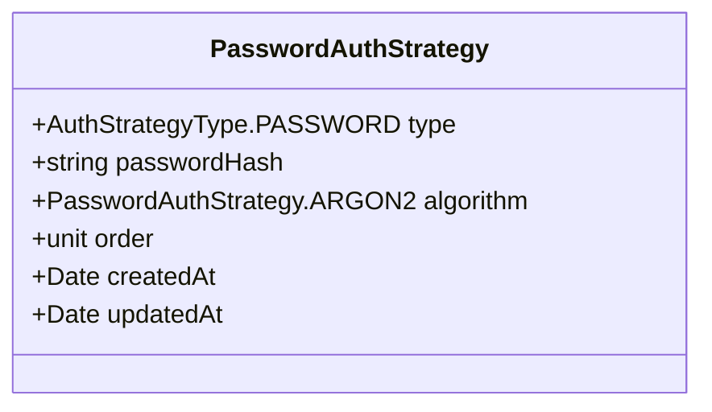
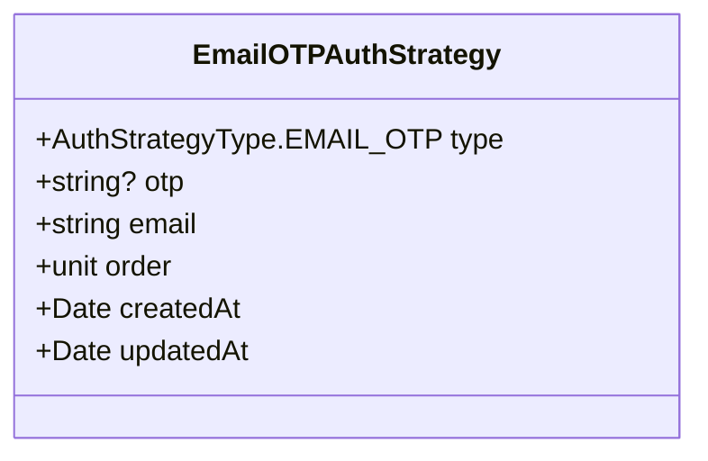
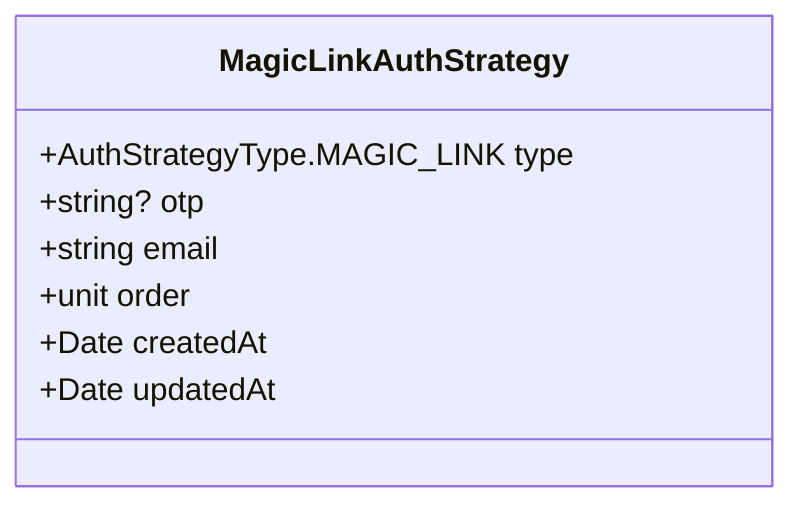
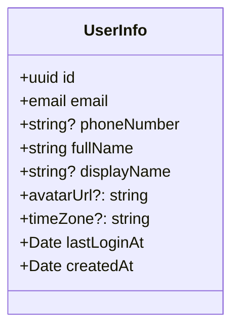
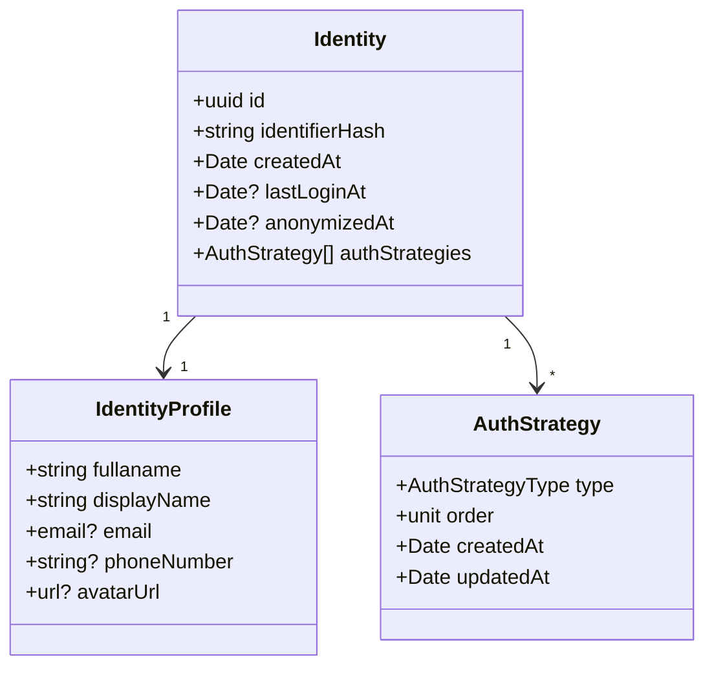

# IDM Draft

- [IDM Draft](#idm-draft)
  - [Authentication](#authentication)
    - [Password](#password)
    - [OTP in SMS](#otp-in-sms)
    - [OTP in email](#otp-in-email)
    - [Magic link](#magic-link)
  - [UserInfo](#userinfo)
  - [Model](#model)
  - [Processes](#processes)

## Authentication

IDM will implement multiple authentication methods:

- Password (email)
- OTP in a SMS (phone number)
- OTP in a magic link (email)
- Authenticator
- FIDO2 or U2F hardware key

User will always be required to provide an email to bind his identity with.

User will be required to choose at least one authentication method.

IDM will allow to setup multifactor authentication (MFA)

User Info will contain an information about what authentication methods had
been used for other services to decide whether the authentication is trustworthy

### Password

Password will be stored hashed with argon2 hashing algorithm.



Password will be checked whether it had been pwned.

There will be a limit of size imposed on password to prevent long pasword service
denial attacks.

### OTP in SMS

```memrmaid
classDiagram
  class SMSOTPAuthStrategy {
    +AuthStrategyType.SMS_OTP type
    +string? otp
    +string phoneNumber
    +unit order
    +Date createdAt
    +Date updatedAt
  }
```

### OTP in email



### Magic link



## UserInfo



## Model



## Processes
