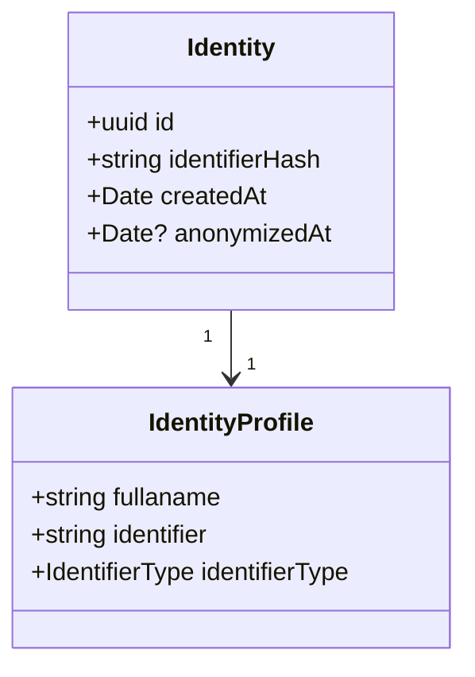

# Identity

User identity

## Basic properties

### `{string}` fullname

We use a fullname as one property because it is the most generic approach to
respect all cultural differences. Fullname can contains family name, middle name
or any kind of name combinations.

### `{string}` identifier

An identifier is a hash created from a combination of indetifier type and identity
unique value. If an identifier type is an email than the value is an actual user email.

### `{string}` identifierType
