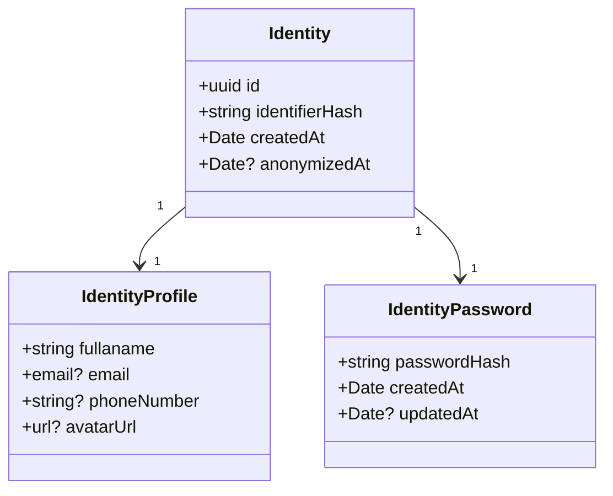

# Intro

```mermaid
classDiagram

  class Identity {
    +uuid id
    +string identifierHash
    +Date createdAt
    +Date? anonymizedAt
  }

  class IdentityProfile {
    +string fullaname
    +email? email
    +string? phoneNumber
    +url? avatarUrl
  }

  class IdentityPassword {
    +string passwordHash
    +Date createdAt
    +Date? updatedAt
  }

  Identity "1" --> "1" IdentityProfile
  Identity "1" --> "1" IdentityPassword
```
