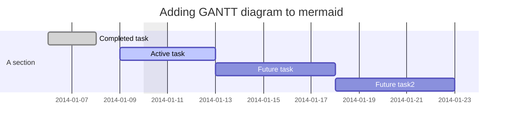
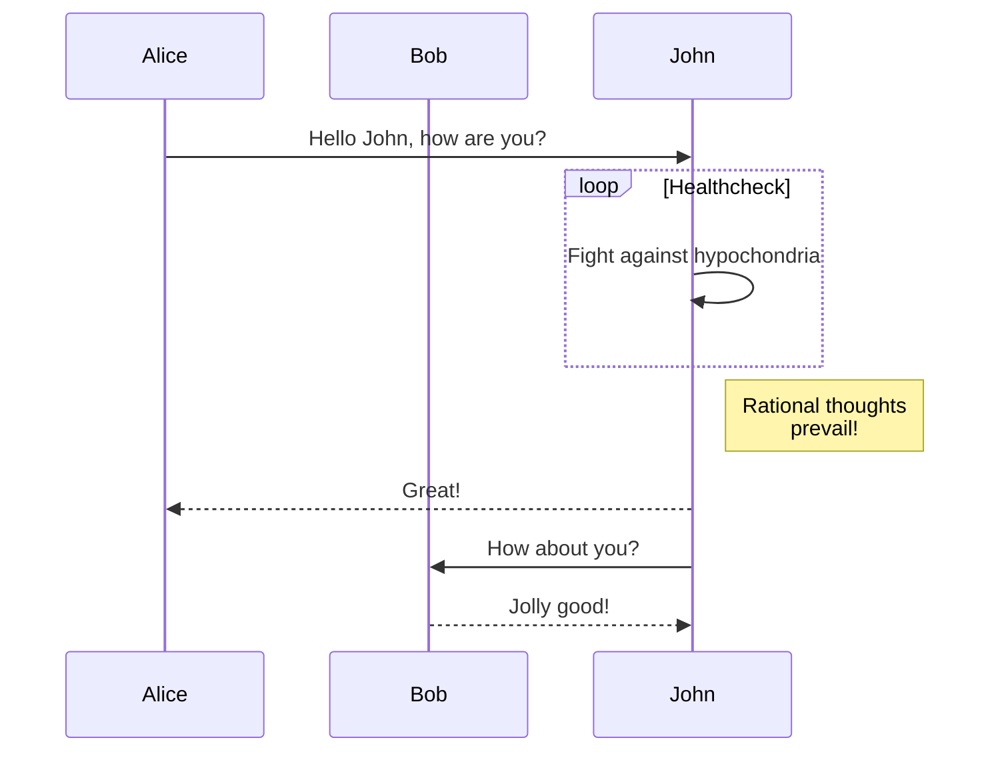

# Verify User

User identification is a process, when an unknown user is recognized by a proving
himself via one of many identity means. Most common way is an identification via
email. User identifies himself by proving that he has access to an email mailbox
by clicking on a link in recieved in an email or writing a code from mail manualy.

Other way could be to write a code from SMS to identify via phone number or another
one would be to identify via postal adress by putting in a code from a physical letter.

## Verification via email

