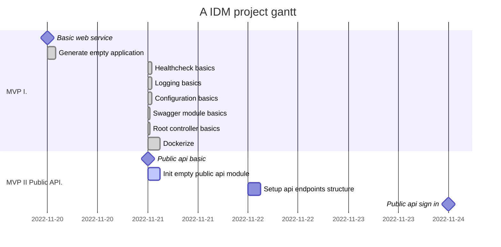

# Project

- **Setup web service basics**
- **Implement a basic application model** with apps info taken from env var and config
- **Register user process**: implement a register user process with basic
  authentication methods (password, email OTP, magic link)
- **Authenticate user process**: implement user authentication, wich will
  redirect to an registered app upon succesfull authentication.
- **Implement a password recovery**
- **Implement account api**:
- **Implement apps management** includes app scopes.

## Gant

Web service basics : milestone, m1, 20.11.2022

## Backlog
